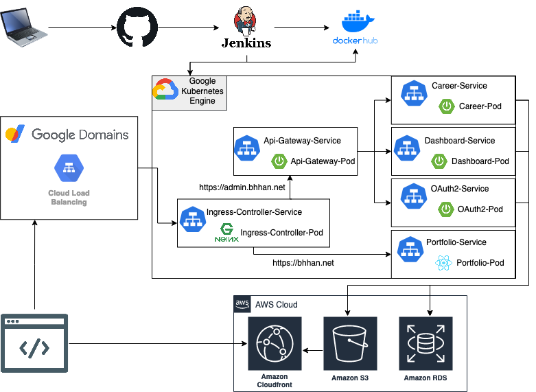
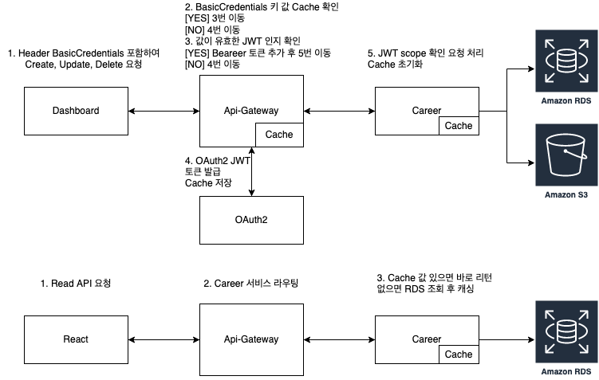

## bhhan-server
> 포트폴리오 백엔드 서버

### 서버 아키텍처

- CI/CD (github -> jenkins -> GKE)
- Spring Cloud OAuth2 (Authorization / Resource Server)
- JPA ORM (Server Domain)
- Spring Security / Thymeleaf (Dashboard Service)
- Spring Cloud Gateway (Routing / Cross cutting concern)
- Kubernetes (Container Orchestration)
- Cloud Resource(AWS S3, CloudFront, RDB(Postgresql), Google Domain)

### 서버 동작

### 어플리케이션 URL
- portfolio - https://bhhan.net
- dashboard - https://admin.bhhan.net

### 프론트엔드 Github
- https://github.com/bhhan5274/bhhan-portfolio
